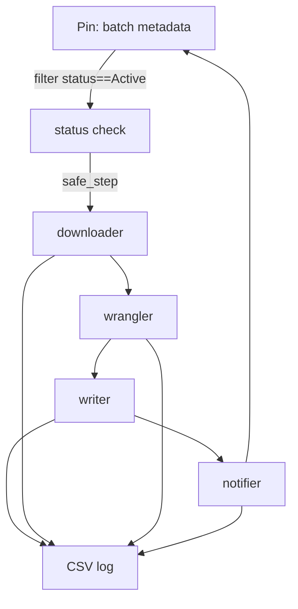

<!-- README.md is generated from README.Rmd. Please edit that file -->

# ORCAwatch – Automated Batch Processing & Reporting for ORCA Jobs

<!-- badges: start -->


<!-- badges: end -->

**ORCAwatch** is KS \&R’s fault-tolerant “air-traffic controller” for our AI-driven open-end response-coding pipeline.
The Quarto document does all the orchestration:

1. pulls batch-job metadata (stored as a **pin** on Posit Connect)
2. checks every “Active” job’s status through **ORCAstra** (our internal async API)
3. downloads finished results and wrangles them with the internal **ksRAI** package
4. writes cleaned `.sav`/`.csv`/`.rds` files to the network share
5. e-mails submitters with location + details
6. updates the metadata pin—and leaves an audit-grade log of every step

> **Key design goal** → *one broken batch never stops another*.
> Every stage is wrapped in a `safe_step()` helper that logs errors, tags rows as `"Error"` in the pin, and moves on.

---

## Table of contents

| section                                              | purpose                                 |
| ---------------------------------------------------- | --------------------------------------- |
| [Architecture](#architecture)                        | Moving parts & packages                 |
| [Installation & local dev](#installation--local-dev) | Workstation setup                       |
| [Environment variables](#environment-configuration)  | All required secrets                    |
| [Runtime workflow](#runtime-workflow)                | What happens at render time             |
| [Logging & error handling](#logging--error-handling) | Where to look when something misbehaves |
| [Quarto report output](#quarto-report-output)        | KPIs, coloured tables, call-outs        |
| [Scheduling on Connect](#scheduling-on-connect)      | Turning it into a daily job             |
| [Roadmap](#roadmap)                                  | What’s next                             |

---

## Architecture

| Layer                | What it does                                                                               | Packages / services                              |
| -------------------- | ------------------------------------------------------------------------------------------ | ------------------------------------------------ |
| **Metadata store**   | Batch job definitions, status, file paths                                                  | `pins` board on Posit Connect                    |
| **Job monitor**      | Checks *only* “Active” rows in metadata                                                    | `httr2`, `safe_step()`                           |
| **Downloader**       | Streams `.jsonl` outputs from **ORCAstra**                                                 | `httr2`, `purrr::map2()`                         |
| **Wrangler**         | Cleans, flags, columnises, binds codes                                                     | **ksRAI** internal pkg                           |
| **Output writer**    | Writes datasets to network share                                                           | `write_orca_output()` helper                     |
| **Notifier**         | Composes HTML e-mails w/ links, KPI table                                                  | `blastula` (development mode honours `DEV_MODE`) |
| **Audit logger**     | CSV log per run + status/error in pin                                                      | `safe_write_log()`, `/mnt/Shiny/ORCA_logs`       |
| **Dashboard report** | HTML page with KPI header, colour-coded tables, call-outs for skips | Quarto, `gt`, `reactable`, `echarts4r`           |

---

## Installation & local dev

```bash
# clone & enter
git clone https://github.com/ksrinc/orcawatch.git
cd orcawatch

# install package deps (renv snapshot)
Rscript -e "renv::restore()"

# render the report locally
quarto render ORCAwatch.qmd
```

> **Tip:** set `DEV_MODE = TRUE` in `.Renviron` to force all outputs to the dev
> share (`/mnt/Shiny/ORCA_dev/`) and send test e-mails only to yourself.

---

## Environment configuration

Add these keys to `~/.Renviron` (or the Connect Environment tab when deploying):

```dotenv
# API & storage
OPENAI_KEY=sk-…
CONNECT_API_KEY=...
CONNECT_SERVER=...
ORCASTRA_ENDPOINT=...

# pin & output paths
PIN_NAME=...
DEV_MODE=TRUE                     # FALSE in production
SMTP_SERVER=...
```

---

## Runtime workflow



1. **Guard & call-outs** – every stage begins with a length-zero guard; if
   nothing to do it prints a Quarto call-out and exits early.
2. **`safe_step()`** – wraps the real code; on error it:

   * appends a row to `log_env$log_df`
   * returns an `orca_error` sentinel so later steps can skip gracefully
3. **Logs** – `safe_write_log()` drops a timestamped CSV under
   `$ORCA_LOG_ROOT`, falling back to `tempdir()` if the share isn’t writable.
4. **Pin update** – any `uid` with at least one `"error"` row gets
   `status == "Error"` plus a concatenated `error_msg`.

---

## Logging & error handling

| artefact                                     | location                | retention                        |
| -------------------------------------------- | ----------------------- | -------------------------------- |
| per-run CSV (`orca_log_YYYYMMDDThhmmss.csv`) | `/mnt/Shiny/ORCA_logs/` | Connect’s purge script (30 days) |
| status & error message                       | same metadata pin       | full history (versioned)         |
| Connect job log                              | Posit Connect UI        | per Connect retention            |

---

## Quarto report output

* **KPI header** – total checked, completed, in-progress, errors (colour-coded).
* **Detailed table** – sortable, searchable `reactable`; error rows tinted red.
* **Error call-outs** – big “note” boxes injected by `add_skip_note()` when a
  stage is skipped or the whole run exits early.

The HTML file is the primary human-friendly artefact; ops engineers can drill
into the CSV for machine-level detail.

---

## Scheduling on Connect

1. Deploy `ORCAwatch.qmd` to your Posit Connect server.
2. In the content **Schedule** tab, set:

   * **Every day at 09:00 America/New\_York**
   * Log output retained for 30 days
   * Auto-refresh environment variables
3. Verify first run completes and writes a log to `$ORCA_LOG_ROOT`.

---

## Contributing

* Fork → feature branch → pull request
* Run `lintr::lint_package()` and ensure the Quarto doc renders with
  `is_dev = TRUE` before opening a PR.
* Unit tests for helpers live in `tests/testthat/` (run `devtools::test()`).

---

## Roadmap

* [x] Fault-tolerant wrappers (`safe_step`)
* [x] Centralised CSV + pin logging
* [x] KPI header & coloured status tables
* [x] Programmatic testing of entire pipeline, including multiple runs
* [x] Staging deployment
* [ ] Work through Z drive write logistics
* [ ] Ongoing assessment and maintenance

See [issues](https://github.com/ksrinc/orcawatch/issues) for the full board.

---

## Questions / support

| role               | contact                                           |
| ------------------ | ------------------------------------------------- |
| Data platform lead | [kwilson@ksrinc.com](mailto:kwilson@ksrinc.com)   |
| Maintainer         | [bcortese@ksrinc.com](mailto:bcortese@ksrinc.com) |

---

## License

© 2025 Knowledge Systems & Research, Inc.
Proprietary & confidential – internal use only.

---

## Acknowledgements

* [Quarto](https://quarto.org/) for rendering
* [pins](https://pins.rstudio.com/) for metadata storage
* [httr2](https://httr2.r-lib.org/) for HTTP
* [blastula](https://github.com/rich-iannone/blastula) for rich e-mailing
* [ksRAI](https://internal.git/ksrai) for wrangling helpers
* The Posit Connect team for a rock-solid scheduler
