---
# RevealJS config lives in ../_quarto.yml.
pagetitle: "ORCA — a collaboration to build an AI-powered Shiny app"
author: "Keaton Wilson · Michael Thomas"
description: |
  posit::conf(2026). Ported from ORCA__AI-powered_survey_coding.pptx.
---

## {.navy .title-slide-custom}

::: {.eyebrow}
POSIT::CONF(2026)
:::

[ORCA]{.display}

[a **collaboration to build** an AI-powered Shiny app, deployed on Posit Team]{.tagline}

::::: {.byline .mt-a}
:::: col
{.headshot}

::: meta
[Keaton Wilson]{.name}
[(Previously) KS&R — Director, Solutions]{.role}
[On ORCA: the back-end pipelines]{.hat}
:::
::::
:::: rule
::::
:::: col
{.headshot}

::: meta
[Michael Thomas]{.name}
[Ketchbrook Analytics — Chief Data Scientist]{.role}
[On ORCA: the interface]{.hat}
:::
::::
:::::

::: notes
**Keaton**:

[welcome, introduce the talk and both presenters].

**Both**:

- [Share the function of what we do]
- [Share the people that we help]
- [Share the impact of that work]

**Michael**:

While we're going to showcase a particular Shiny app in this presentation, this talk is really about *collaboration*.
:::

## {.cream}

:::: {.split .split-even .v-center .fill}
::: col
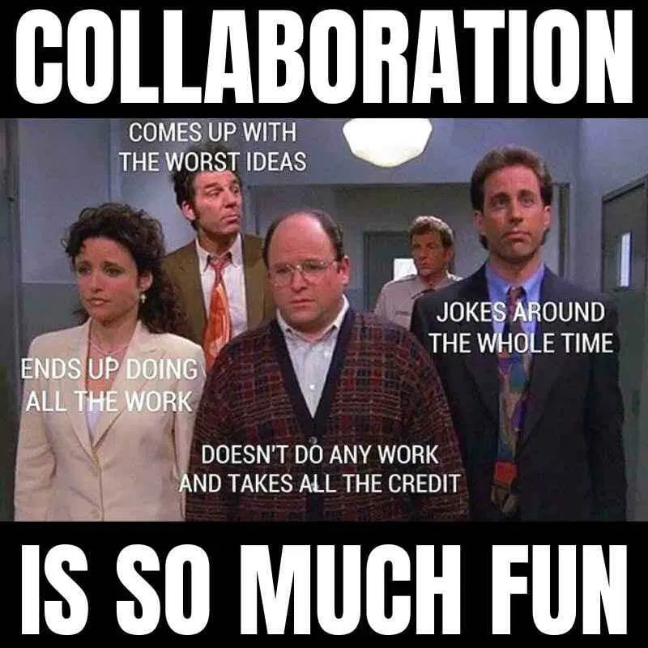{width="880"}
:::
::: col
::: {.eyebrow}
LET'S START HERE
:::

[We've all been on this team.]{.headline}
:::
::::

::: notes
**Keaton**:
- group projects in school,
- to cross-functional committees at companies we work for
- business-consultant partnerships developing code and software.
- The work might not be evenly distributed
- some people may be engaged more than others
- power dynamics or seniority might affect who actually gets credit at the end.
:::

## {.cream}

:::: {.split .split-even .v-center .fill}
::: col
{width="880"}
:::
::: col
::: {.eyebrow}
BUT IT DOESN'T HAVE TO BE
:::

[This one actually worked.]{.headline}
:::
::::

::: notes
**Keaton**:
The collaboration that we're presenting on today is one that truly *worked* — two companies, one app, and we still like each other.

**Michael**:
- By a show of hands, how many work on teams of more than one data scientist?
- And how many folks in the room typically work as a lone wolf solo data scientist at their day job?
- And how many hate voting in polls?  [Wait for hands to raise / laughs]
:::

## Categorizing open-end survey responses is slow, manual, and inconsistent at scale {.paper}

::: {.eyebrow}
WHY ORCA EXISTS
:::

[AI can accelerate the work of categorizing thousands of free-text answers. But for a research firm's internal stakeholders and clients, speed means nothing without trust in the result.]{.lede .mt-md}

::: {.chips .mt-lg}
[Transparency]{.chip}
[Trust]{.chip}
[Reproducibility]{.chip}
:::

::: notes
**Michael**:

In just a moment, Keaton is going to talk about "open-end survey coding". But when we say *coding*, we don't mean R or Python code -- we're talking about taking free-text data from user surveys and tagging them as belonging to one of many possible fixed categories. You might be able to think of it along the same lines as sentiment analysis, but instead of measuring how positive or negative the sentiment in a paragraph of text is, we're instead wanting to *categorize* what that paragraph of text is talking about -- and assigning it to a single pre-defined category.

**Keaton**:

- slow and manual process, lots of human time.
- also be *inconsistent* at scale.
- The team at KS&R had a hypothesis that AI could accelerate this task — but we knew that internal stakeholders and clients would not accept a "black box" doing this work.
:::

## {.paper .shot}

::::: {.split .fill}
:::: col
::: {.eyebrow}
WHAT IS ORCA — STEP 1 OF 4
:::

[Upload data]{.headline}

::: bullets
- Point ORCA at the **column of open-end responses**, plus a unique ID column
- Optionally **filter the rows** first, so a run covers only the cut you care about
:::
::::

:::: col
[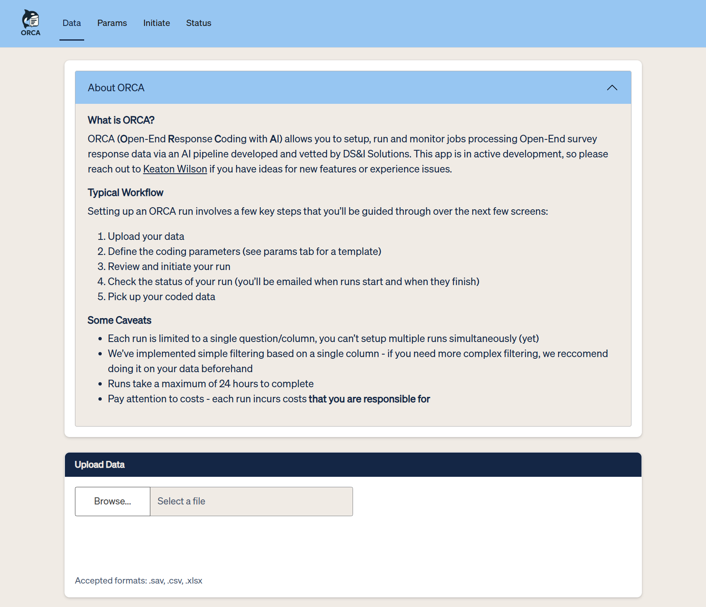[]{.hl .fragment data-fragment-index="1" data-label="Pick columns, filter rows" style="left:8.6%; top:74.4%; width:82.5%; height:23.6%;"}]{.frame}
::::
:::::

::: notes
**Keaton**:

We're going to work a bit backwards today and first show you what the final solution looked like.

Step one — the researcher uploads the open-end response data.
- Multiple file types are supported, and the researcher can pick which columns to use and optionally filter the rows so a run covers only the cut they care about.
:::

## {.paper .shot}

::::: {.split .fill}
:::: col
::: {.eyebrow}
WHAT IS ORCA — STEP 2 OF 4
:::

[Define categories and set parameters]{.headline}

::: bullets
- Start from a **pre-built template** — a codeframe a researcher already has
- Or **build it in the app**, adding and editing categories one at a time
:::
::::

:::: col
[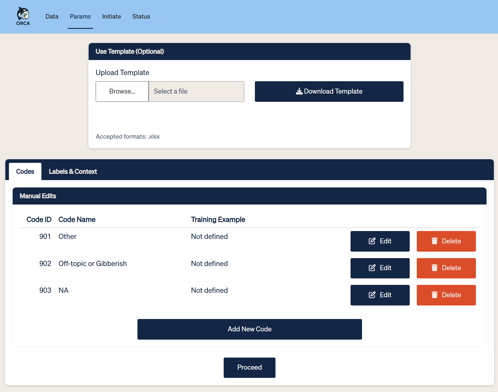[]{.hl .fragment data-fragment-index="1" .chip-right data-label="Upload a template" style="left:17.5%; top:10.8%; width:65.0%; height:26.6%;"}[]{.hl .fragment data-fragment-index="1" data-label="Or build it interactively" style="left:2.2%; top:40.2%; width:95.6%; height:48.0%;"}]{.frame}
::::
:::::

::: notes
Keaton: step two — they define the codeframe (set of categories) the AI will code against.
- also set parameters for the run, like context, multi-code scenarios, and others

:::

## {.paper .shot}

::::: {.split .fill}
:::: col
::: {.eyebrow}
WHAT IS ORCA — STEP 3 OF 4
:::

[Review &amp; initiate]{.headline}

::: bullets
- Every run is **tagged to a person and a project**, and lands at a known path
- Researchers are **emailed** when a run starts and when it finishes
- The **estimated cost** is on screen before anyone can hit go
:::
::::

:::: col
[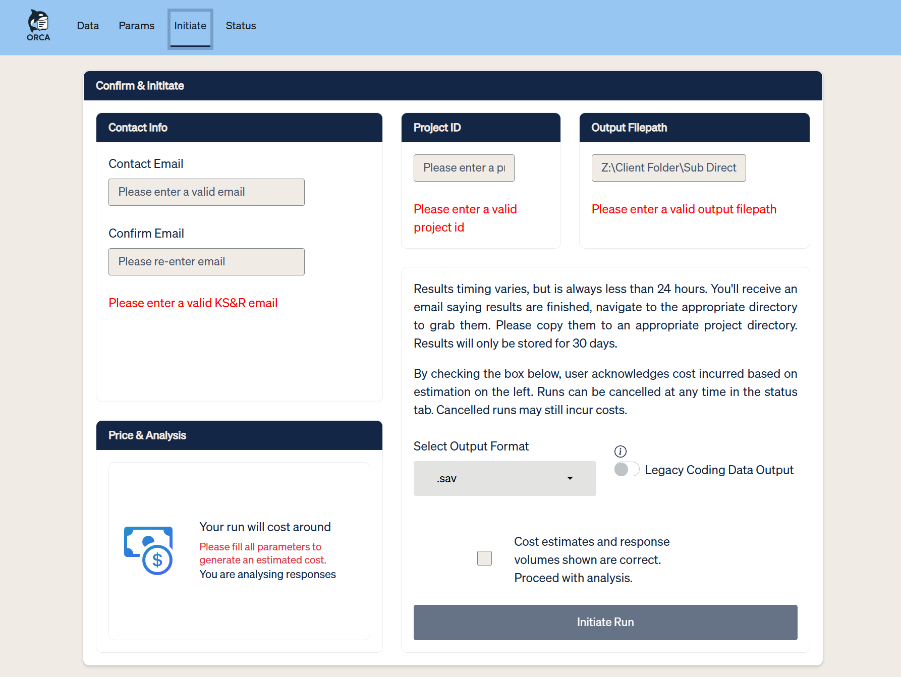[]{.hl .fragment data-fragment-index="1" .chip-right data-label="Who to notify" style="left:10.4%; top:16.7%; width:32.0%; height:42.8%;"}[]{.hl .fragment data-fragment-index="1" data-label="Which run, where it lands" style="left:44.2%; top:16.7%; width:45.8%; height:20.0%;"}[]{.hl .fragment data-fragment-index="1" data-label="What it will cost" style="left:10.4%; top:62.0%; width:32.0%; height:34.3%;"}]{.frame}
::::
:::::

::: notes
Keaton: step three — review the setup and kick off the job.
- Logging
- Automated email notifications
- Cost estimation (big!)
:::

## {.paper .shot}

::::: {.split .fill}
:::: col
::: {.eyebrow}
WHAT IS ORCA — STEP 4 OF 4
:::

[Track &amp; pick up]{.headline}

::: {.kicker}
This is now how KS&R's researchers code **thousands** of open-end responses.
:::
::::

:::: col
[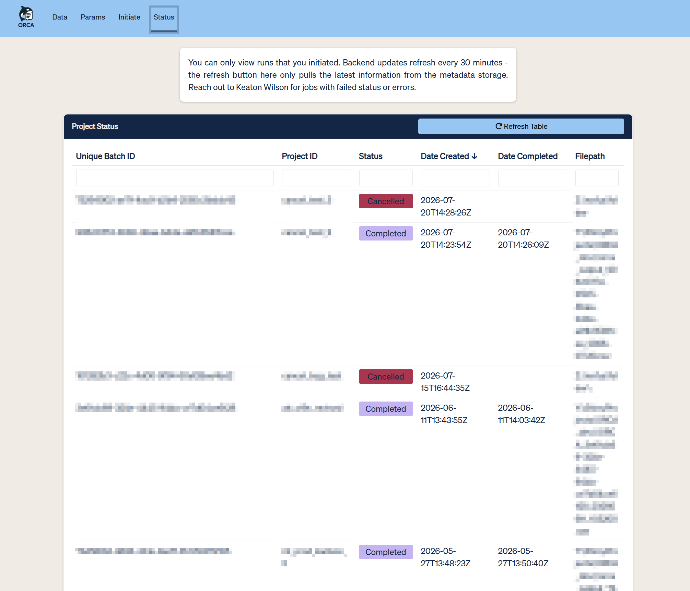]{.frame}
::::
:::::

::: notes
Keaton: step four — track the job and pick the results back up when it's done.

The proof is in the pudding: ORCA is now how KS&R's researchers code thousands of open-ended survey responses with AI — in production, in daily use.
:::

<!-- TODO // We may want to improve this transition across these next 3 slides to move from the showcase of the app UI into the overview & then details of the successful collaboration -->

## So how did we do it? {.navy .statement}

[A front-end team and a back-end team, at **two different companies**, who had to depend on each other to ship anything at all — and built the collaboration that made that dependency work.]{.lede}

::: notes
*Keaton*
- you've now seen the problem and the thing we shipped.
- But harkening back to our first slide, how did we we actually make this collaboration work?
:::

## One system, two companies {.cream}

::: {.eyebrow}
A CROSS-COMPANY BUILD
:::

[Built as one of KS&R's DS&I project teams — a research firm and an external consultancy, one shared build.]{.cap .mt-sm}

::::: {.versus .fill .mt-md}
:::: {.card .centered}
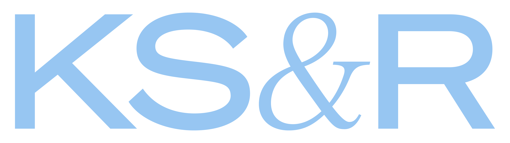{.logo-xl}

::: foot
[Research firm — backend & infrastructure owner]{.cap}
:::
::::
::: glyph
\+
:::
:::: {.card .centered}
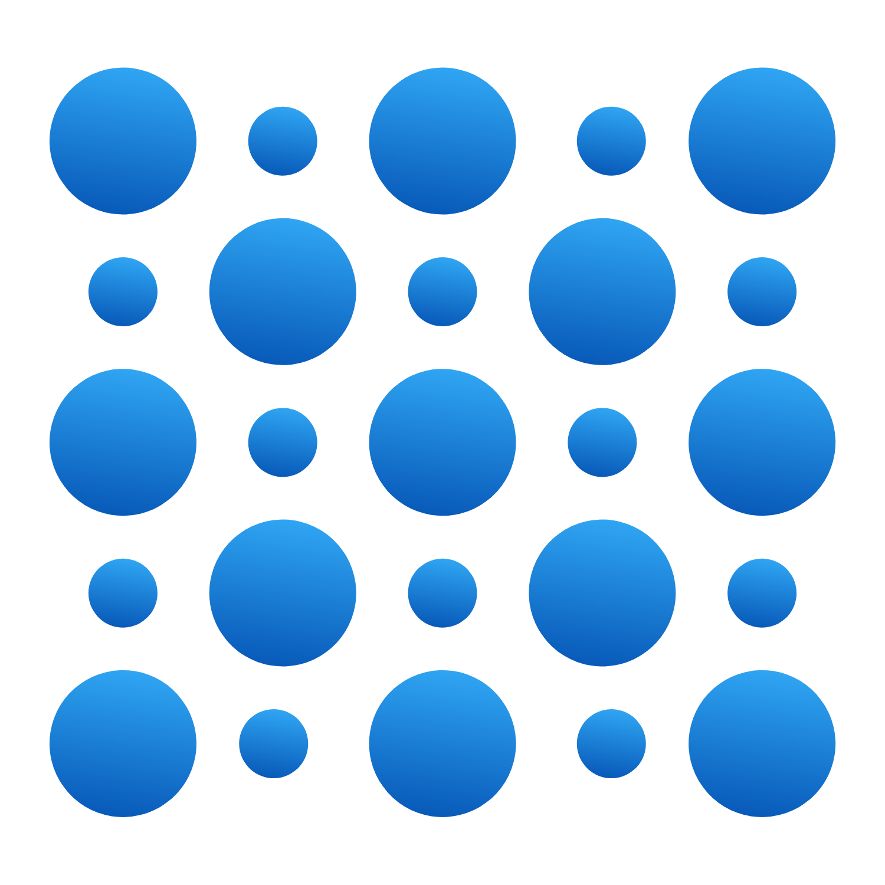{.logo-lg}

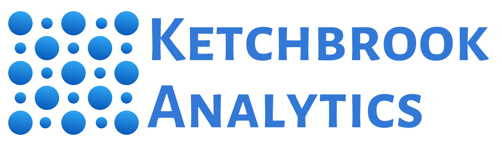{.logo-md}

::: foot
[Consultancy — front-end & UX owner]{.cap}
:::
::::
:::::

::: {.kicker}
Why not in-house? A one-developer team, several competing priorities, and a lift that needed to happen **now**.
:::

::: notes
*Michael*
The work to build this solution was very explicitly divided: KS&R owned the back-end, server-side code, and the front-end user interface was Ketchbrook's responsibility.

Maybe this sounds scary, but there are some obvious benefits to this:

- Speed: if you can truly work in parallel, obviously two people working simultaneously will get the job done faster than one
- Error catching: more eyes on the code is more likely to catch issues
- Diversity of thought: the best ideas will prevail (as opposed to only one person's idea)
- Specialization: no one individual person has to be a jack-of-all-trades — people can focus on what they're best at

~~In our case, there were even some other additional benefits:~~

Here's how we rationalized dividing up the work in this particular case. We're not necessarily advocating for this exact delegation strategy -- you may find in your own projects that separating the work between multiple parties works better by delegating different pages of an app to different developers, adopting our front end vs. back end strategy, or something totally different. Just make sure the split it is *well-defined*.

KS&R found that the front-end/back-end delegation led to lower institutional and financial risk for an external partner -- like Ketchbrook -- to touch the AI-spend involved.

And from our perspective, we *prefer* to not have to hold on to our clients' API keys or sensitive data so that we don't have to deal with the responsibility of securing that -- the best security posture is having nothing sensitive to secure in the first place.

*Keaton*
- One developer call out. We weren't missing skills in-house, but we were missing bandwidth. The team at KS&R was already stretched across several competing priorities, and this lift needed to happen *now*.

~~Feedback: Have Keaton talk about *why* KS&R sought out an external collaborator as opposed to just doing it themselves in-house.~~ (addressed)
:::

## {.navy}

::: {.eyebrow}
TWO LENSES ON ONE BUILD
:::

::::: {.split .split-even .ruled .fill .mt-md}
:::: col
[Michael]{.who}

[The Shiny front end]{.sub}

::: bullets
- Job submission, response review, interactive category editing
- Built with [golem]{.pkg} for long-term maintainability and modularity
:::
::::
:::: col
[Keaton]{.who}

[The Posit-based back end]{.sub}

::: bullets
- [plumber]{.pkg} middleware and [pins]{.pkg} for data hand-off
- Scheduled Quarto workflows
- Every piece deployed on **Posit Connect**
:::
::::
:::::

::: hrule
:::

::: {.kicker}
The throughline: at every stage, a front-end decision made the back-end's job **harder or easier** — and vice versa.
:::

::: {.next}
Next — Michael, on designing together before writing code →
:::

::: notes
Keaton: two lenses on what follows — Michael on the Shiny front end (job submission, response review, interactive code editing), me on the Posit-based back end (plumber, pins, scheduled Quarto workflows) — all of it deployed on Posit Connect. Over to Michael.
:::

## A stable seam between two codebases {.cream}

::: {.eyebrow}
THE ARCHITECTURE THAT MADE IT POSSIBLE
:::

::::: {.arch .fill .mt-md}
:::: {.card .centered style="grid-area:1/1/2/4;"}
[ORCA]{.sub}
[[golem]{.pkg} Shiny app]{.cap}
[Ketchbrook]{.tenant}
::::

::: {.glyph style="grid-area:1/4/2/5;"}
↔
:::

:::: {.card .navy .centered style="grid-area:1/5/2/8;"}
[ORCAstra]{.sub}
[[plumber]{.pkg} API]{.cap}
[KS&R]{.tenant}
::::

::: {.glyph style="grid-area:1/8/2/9;"}
→
:::

:::: {.card .centered .muted style="grid-area:1/9/2/12;"}
[OpenAI]{.sub}
[batch classification]{.cap}
::::

::: {.wire .up-right .muted style="grid-area:2/4/3/6;"}
:::

::: {.wire .up-left .muted style="grid-area:2/7/3/9;"}
:::

:::: {.card .centered .muted style="grid-area:3/3/4/6;"}
[ORCAdb]{.sub}
[[pins]{.pkg} metadata & run history]{.cap}
[KS&R]{.tenant}
::::

::: {.glyph .muted style="grid-area:3/6/4/7;"}
↔
:::

:::: {.card .centered .muted style="grid-area:3/7/4/10;"}
[ORCAwatch]{.sub}
[scheduled Quarto job — writes .sav / .csv / .rds to the network share, then emails the submitter]{.cap}
[KS&R]{.tenant}
::::
:::::

::: {.kicker}
The UI iterated against a stable API surface while the heavier logic behind it kept changing. **Everything greyed out here we'll come back to.**
:::

::: notes
**Keaton**:
The architecture that made this possible. Focus on the top row: a golem-based Shiny app decoupled from a plumber API for async job processing, so the UI could be built and iterated against a stable API surface while the heavier AI/coding logic evolved behind it. ORCAstra is what actually talks to the OpenAI batch API — the front end never holds a key.

Don't dwell on the greyed pieces — just name them so the shape is on screen: ORCAdb is a pins board on Connect holding batch metadata and run history; ORCAwatch is a scheduled Quarto document that polls ORCAstra for finished jobs, reads and updates that pin, and writes the cleaned files out to the network share, then emails the submitter once delivery is complete. We come back to both in chapter 3.
:::

## Designing together, before writing a line of code {.navy .chapter}

::: {.eyebrow}
CHAPTER 1
:::

::: {.speaker}
Michael
:::

::: hrule
:::

::: chips
[Mural]{.chip}
[KS&R brand book]{.chip}
[Design system & font files]{.chip}
:::

::: notes
Michael takes over.
:::

## Wireframing together before a single line of code {.cream}

::: {.eyebrow}
SHARED UNDERSTANDING, FIRST
:::

::: bleed
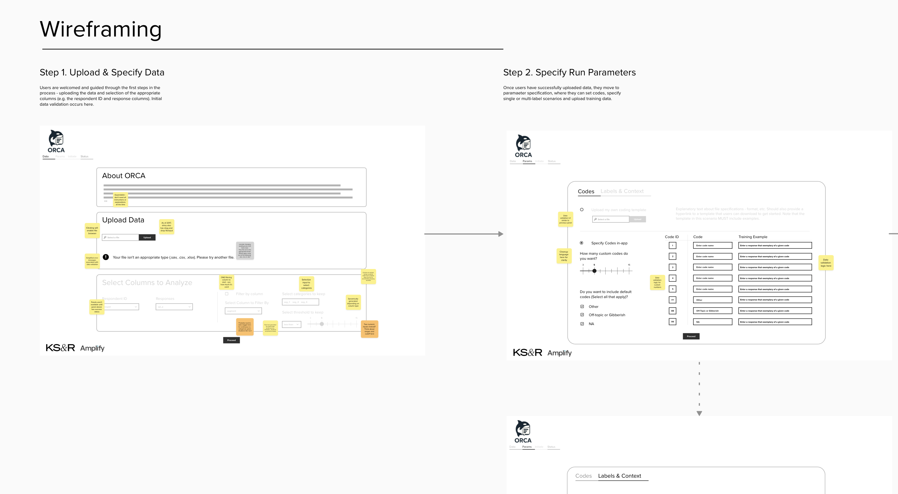{.pin style="left:100px;  top:248px; width:816px;"}
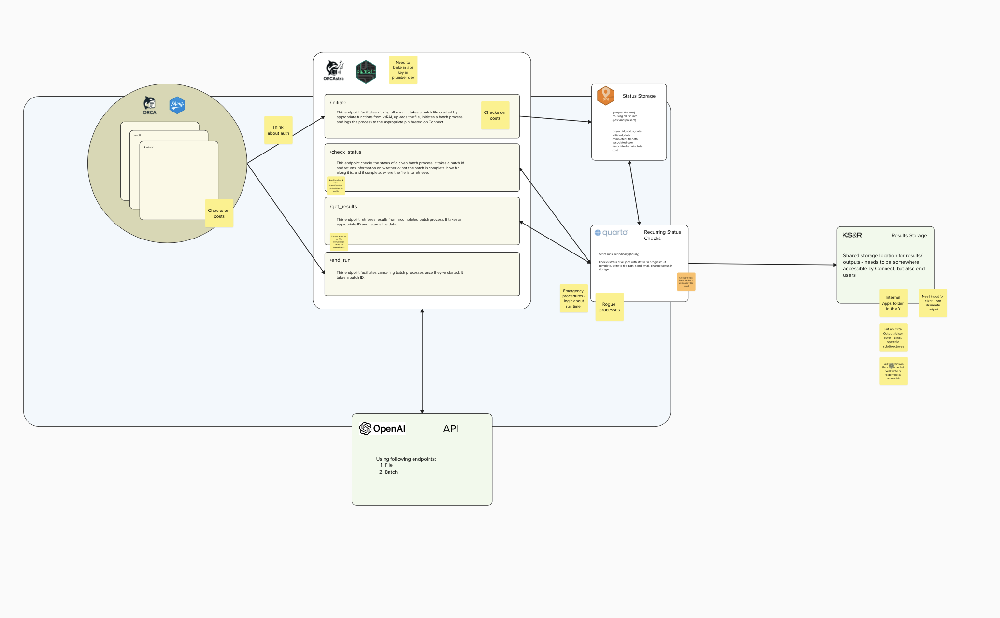{.pin style="left:678px;  top:517px; width:816px;"}
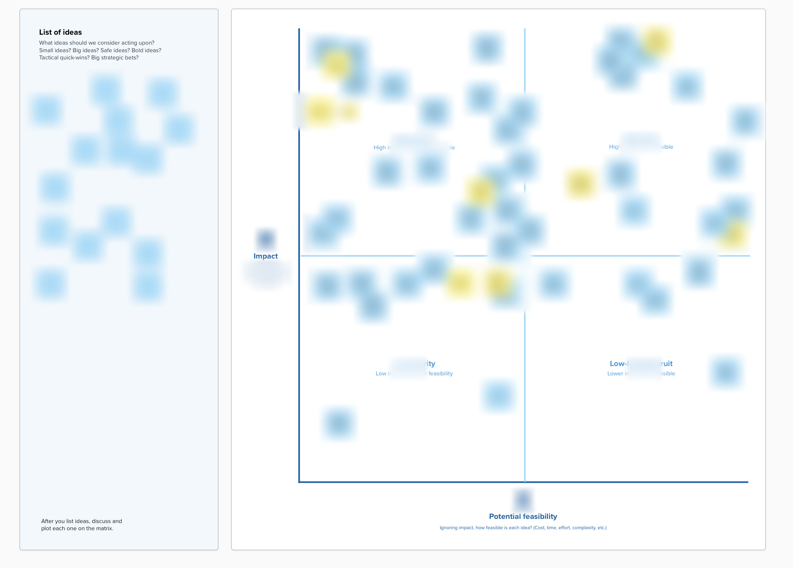{.pin style="left:1196px; top:634px; width:686px;"}

[Stakeholder engagement, wireframes and API shape, sketched together in Mural — before either side committed to an implementation.]{.pin .lede style="left:1209px; top:300px; width:615px;"}
:::

::: notes
[Ground the audience back to the app, as we're now talking about the design]

~~Feedback: For each phase of the project (before, during, after), we need to have an *active takeaway* for the audience that reinforces the **collaboration**.~~ (addressed: one takeaway slide now closes each chapter — "Draw the contract before you build it", "Make the issue the interface", "Build a seam, not a handoff")

Michael: shared understanding first. Wireframing sessions in Mural, where UI mockups and API/data shape were sketched in the same room before either side committed to an implementation.
:::

## The brand book as a forcing function {.paper}

::: {.eyebrow}
CONSTRAINTS AS A GIFT
:::

[Early visual constraints gave the front end a fixed target — which in turn gave the back end a stable target: what data the UI would need, in what shape, on what cadence.]{.lede style="margin-top:320px; max-width:860px;"}

::: bleed
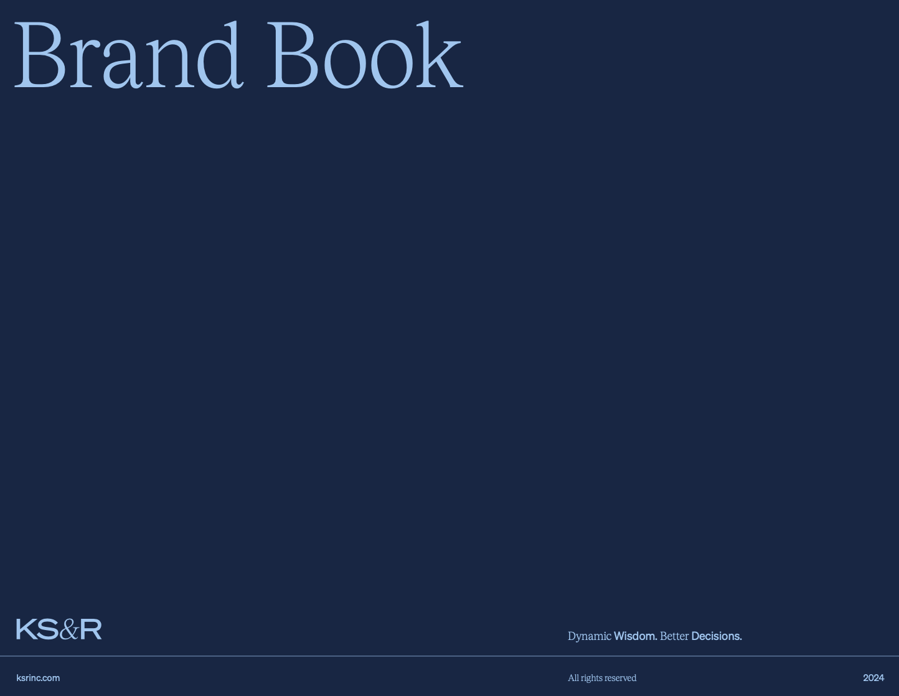{.pin style="left:1313px; top:0px;    width:607px;"}
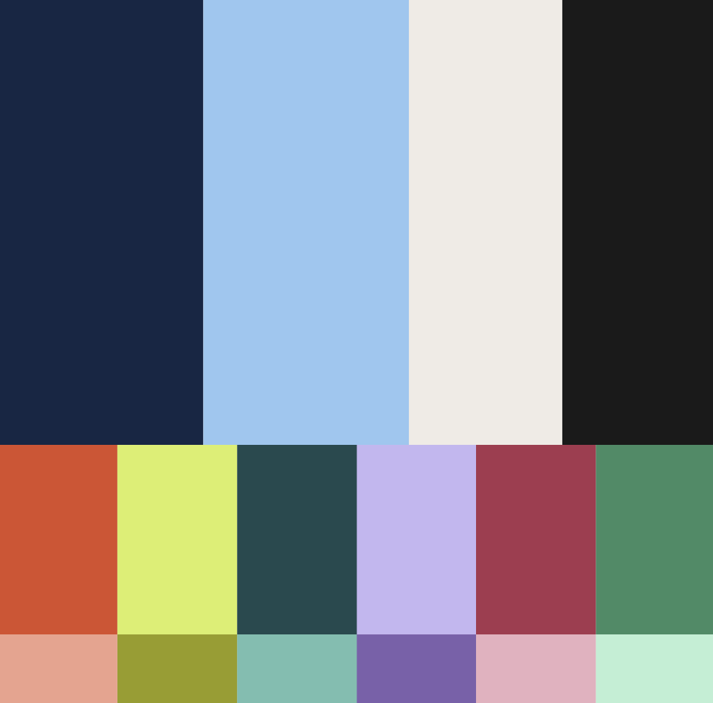{.pin style="left:1313px; top:252px;  width:607px;"}
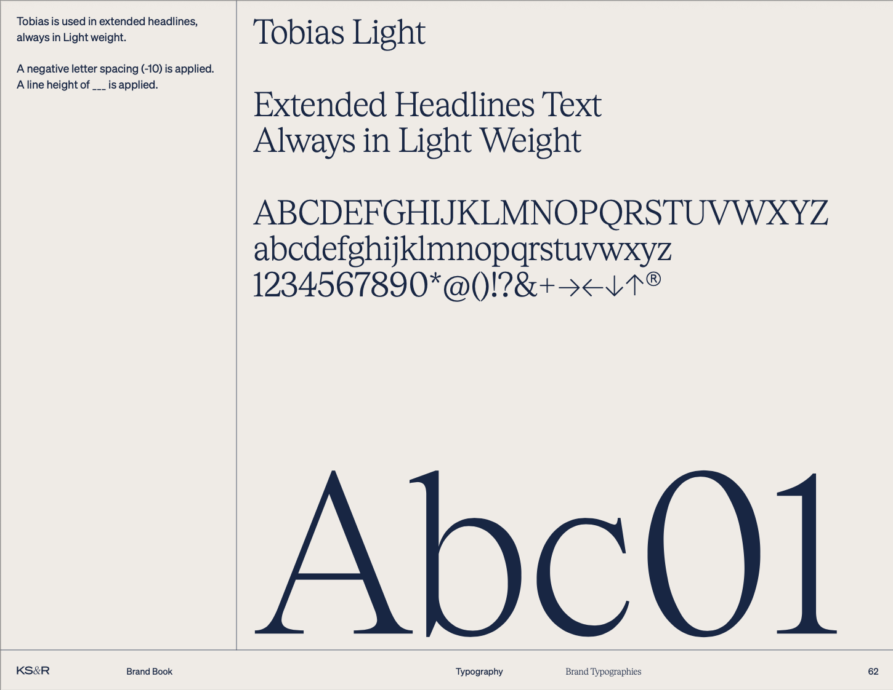{.pin style="left:1313px; top:848px;  width:304px;"}
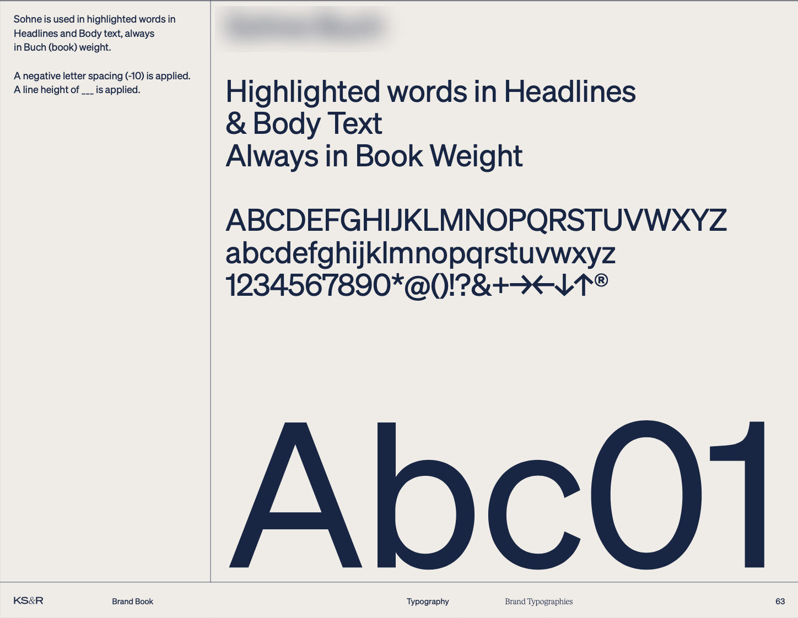{.pin style="left:1616px; top:846px;  width:304px;"}
:::

::: notes
Michael: KS&R's brand book and design system as a forcing function — it gave the front end constraints early, which gave the back end a stable target: what data the UI would need, in what shape, on what cadence.
:::

## One workflow, two contracts {.cream}

::: {.eyebrow}
THE KEY MOVE
:::

:::: {.split .split-even .fill .mt-md}
::: col
[]{.frame .crop style="height:697px;"}
:::
::: {.col .middle-stack}
[Submit a coding job]{.bar}
[Review AI suggestions]{.bar}
[Edit & approve]{.bar}

[↓]{.glyph}

::: {.row .tight}
[UI spec]{.tag}
[API contract]{.tag}
:::
:::
::::

::: notes
**Michael**:

Now we're moving from pure UI design and styling into thinking about UX.

Having a clear sense ("contracts") of what the incoming data is going to look like is critical to buildling a UI that supports the actual user workflow, accomplishes what KS&R was looking for from an expected UX.

Also having well-defined contracts of what the *outgoing* data should look like (i.e., the data going to the back-end API that Keaton was developing) ensured that we were setting him up for success.

These contracts also helped us "defensively program" against anything that would *break* that contract, and allow us to point users back in the right direction as opposed to giving them a "Server disconnected" error message and the app shutting down.

The big picture here -- neither KS&R nor Ketchbrook were every guessing at or assuming the other's needs.
:::

## Tips for a successful Design phase {.paper}

::: {.eyebrow}
TAKEAWAY — BEFORE YOU BUILD
:::

::: {.bullets .lg .mt-lg}
- Before your next cross-team project starts, get both sides in front of **one shared visual artifact** — Mural, Excalidraw, a whiteboard photo. Not a spec document.
- Argue about it there, while changing it costs nothing. Every disagreement you surface on the wireframe is one you don't discover in a pull request three weeks later.
:::

::: notes
Michael, active takeaway for chapter 1: the thing to actually do on Monday is get a shared visual artifact in front of both teams before anyone opens an editor. Cheap to change, and it forces the disagreements out early.

You may not catch *everything* here -- smaller things may come up as you actually go from 2D static design document to a living, breathing app... **but** this will help expedite so many of those future nitpicks and the major concepts will be agreed upon up front.
:::

## Building in parallel, without blocking each other {.navy .chapter}

::: {.eyebrow}
CHAPTER 2
:::

::: {.speaker}
Michael
:::

::: hrule
:::

::: chips
[GitHub Issues & PRs]{.chip}
[[golem]{.pkg}]{.chip}
[[plumber]{.pkg}]{.chip}
:::

::: notes
Michael continues into chapter 2.
:::

## Issues and PRs as the shared source of truth {.paper}

::: {.eyebrow}
WORKING ASYNC, ACROSS COMPANIES
:::

:::: {.cols-2 .mt-lg}
::: col
[GitHub Issues tracked what needed to happen and who owned it — across two companies, with no shared Slack or shared employer.]{.lede}
:::
::: col
[A branching model let each side ship independently against the agreed contract, and merge without stepping on the other's work.]{.lede}
:::
::::

::: notes
**Michael**:

Communication can be tricky when you're collaborating across different organizations like we were. Communicating within Microsoft Teams or Slack might not always be possible depending on your IT teams' posture/infrastructure/security. And email is an extremely inefficient way to program together.

We needed a communication vehicle that would allow us to not only check in with each other and provide project status updates, but could also serve as a task-oriented tool that would hold us both accountable and provide a single source of truth. GitHub Branches, Issues and PRs fit that mold perfectly, allowing us to see each other's progress and work asynchronously without impeding one another.
:::

## Not an assertion — **receipts.** {.navy .statement}

[Issues, PRs, and a contract everyone could point to — that's why this collaboration held together.]{.lede}

## Make the issue the interface {.paper}

::: {.eyebrow}
TAKEAWAY — WHILE YOU BUILD
:::

::: {.bullets .lg .mt-lg}
- Write Issues and PR bodies for **someone who doesn't share your codebase, your standup, or your employer**. Detail that feels excessive inside one team is the bare minimum across two.
- If a decision only exists in a call or a DM, it doesn't exist. Put it where the other company can find it without asking you.
:::

::: {.next .mt-lg}
Next — Keaton, on earning trust in production →
:::

::: notes
Michael, active takeaway for chapter 2: over-document across the boundary. The written trail is what let us work in parallel without blocking each other — and it's the habit that transfers to any partner team. 

< clean these up >

Over to Keaton for chapter 3.
:::

## UX needs and backend constraints, both ways {.paper}

::: {.eyebrow}
IT WENT BOTH DIRECTIONS
:::

:::: {.split .split-even .fill .mt-md}
::: {.col .middle-stack}
::: {.row .exchange}
[Live job status & inline editing of AI output]{.bar .cream}
[→]{.glyph}
[Async job handling, structured logging]{.bar .solid}
:::

::: {.row .exchange .mt-sm}
[Batch cost & timing]{.bar .solid}
[→]{.glyph}
[Progress states, review queues]{.bar .cream}
:::
:::
::: col
[]{.frame .crop style="height:639px;"}

[The status table users asked for — and the structured logging behind it.]{.cap .mt-sm}
:::
::::

::: notes
We even ran into situations where things that were outside of the scope of our initial design popped up that we needed to accomplish. [Provide the example on this screen, and discuss how it went both ways]. GitHub Issues/PRs made this "on-the-fly" bi-directional collaboration *efficient*.

Michael: a UX need — live job status, inline editing of AI output — drove a backend design decision (async job handling, structured logging). A backend constraint — batch cost and timing — shaped a front-end pattern (progress states, review queues).
:::

## Separation of concerns, in production {.navy .chapter}

::: {.eyebrow}
CHAPTER 3
:::

::: {.speaker}
Keaton
:::

::: hrule
:::

::: chips
[[pins]{.pkg}]{.chip}
[Posit Connect]{.chip}
[Scheduled Quarto]{.chip}
:::

::: notes
Keaton takes back over for chapter 3.
:::

## A modular backend, decoupled by design {.cream}

::: {.eyebrow}
WHAT MADE PARALLEL WORK POSSIBLE
:::

::::: {.cols-4 .fill .mt-md}
:::: card
[ORCA]{.sub}

::: {.row .hexrow}
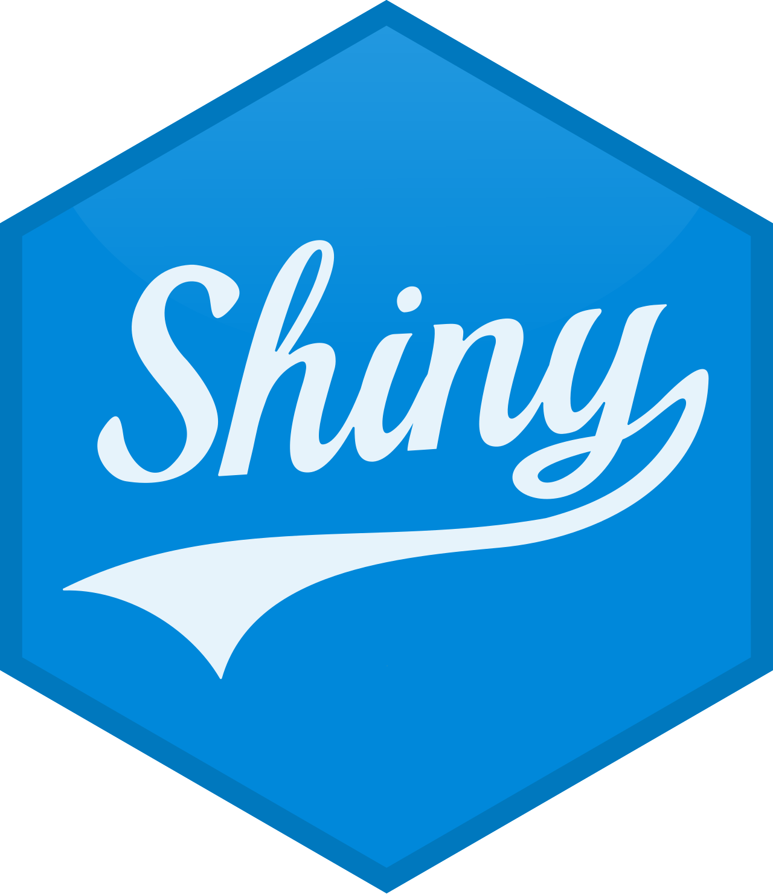{.hex}
[Shiny front end]{.cap}
:::

::: {.row .hexrow}
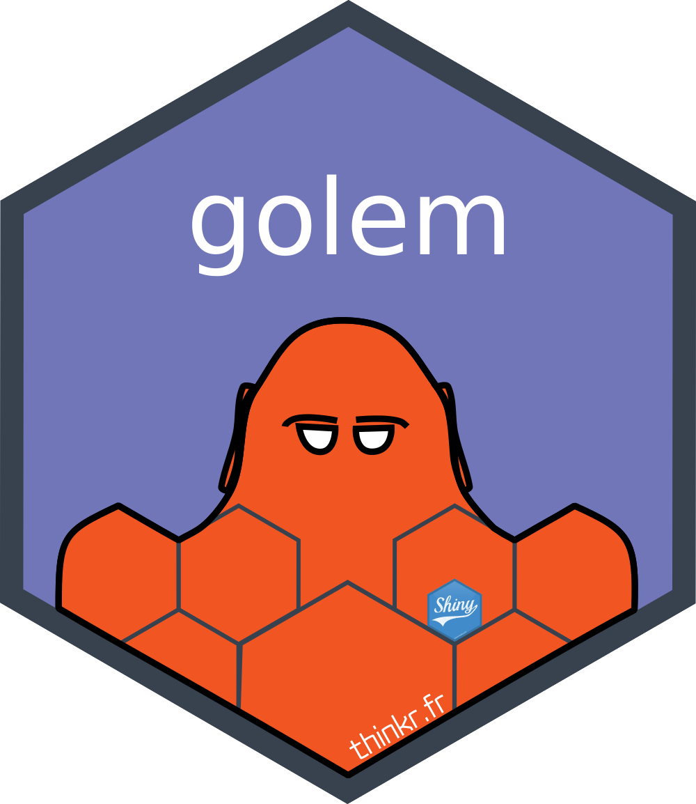{.hex}
[[golem]{.pkg} for modularity and maintainability]{.cap}
:::

::: {.row .hexrow}
{.hex}
[[bslib]{.pkg} for theming]{.cap}
:::

::: {.row .hexrow}
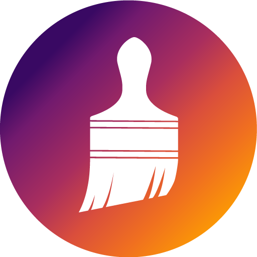{.hex}
[[brand.yml]{.pkg} — KS&R's brand book dropped straight in]{.cap}
:::
::::
:::: card
[ORCAstra]{.sub}

::: {.row .hexrow}
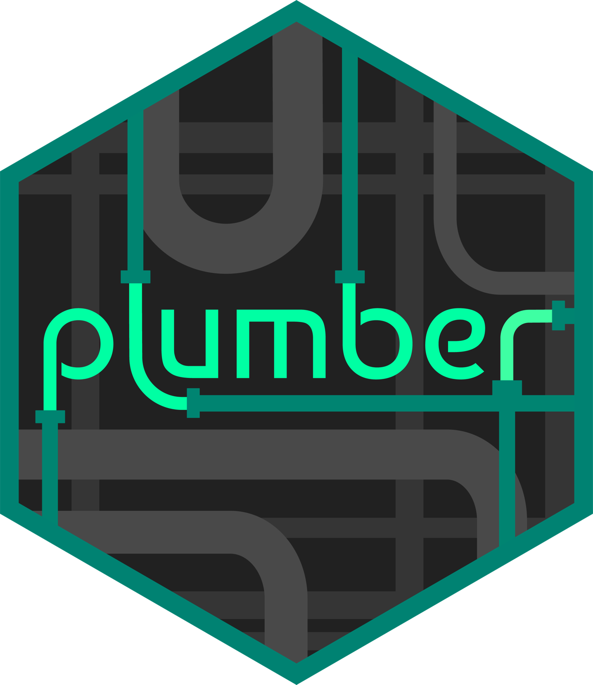{.hex}
[[plumber]{.pkg} — a well-defined surface per core function, hosted internally]{.cap}
:::

::: {.row .hexrow}
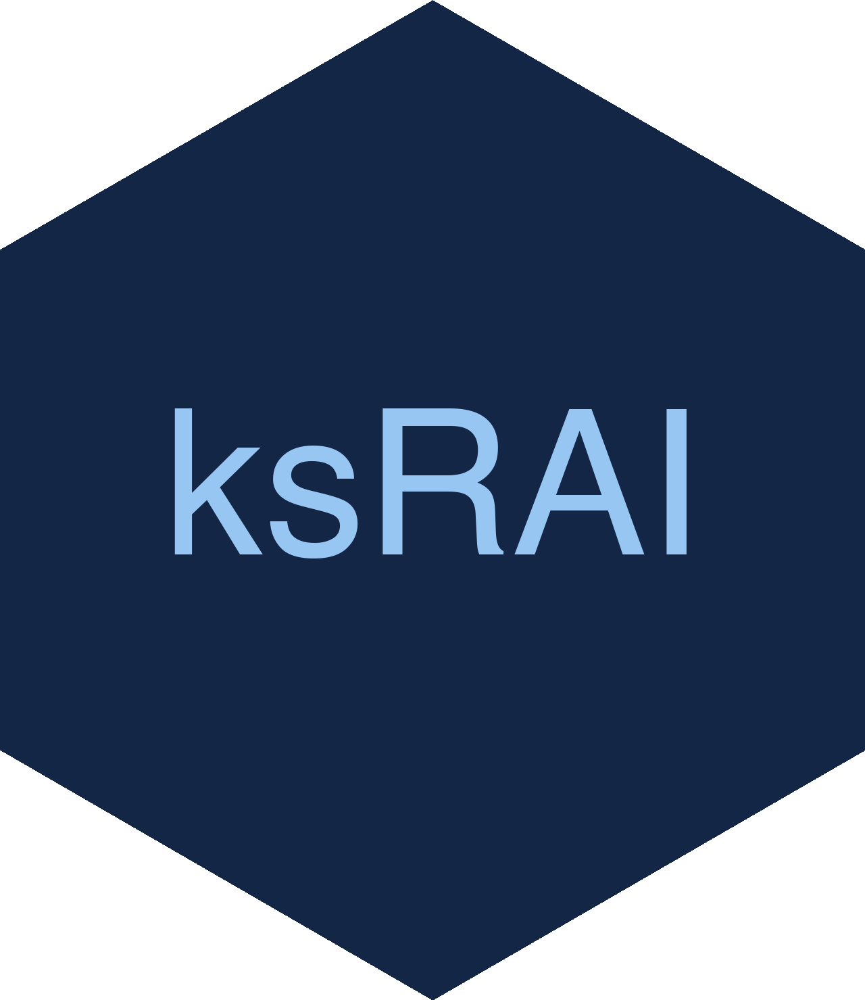{.hex}
[[ksRAI]{.pkg} — our internal package wrapping the OpenAI API]{.cap}
:::
::::
:::: card
[ORCAdb]{.sub}

::: {.row .hexrow}
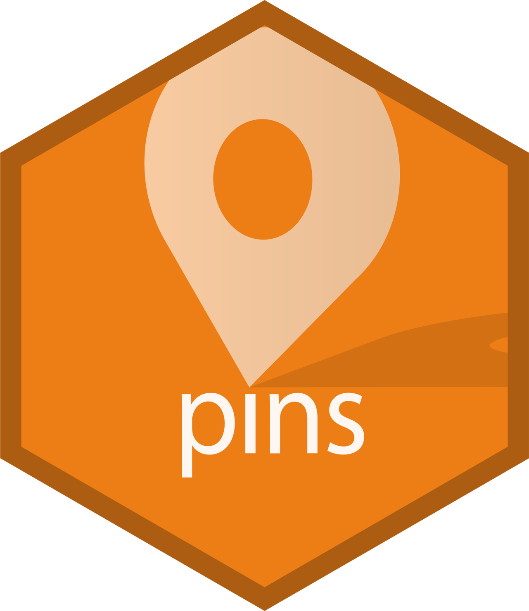{.hex}
[[pins]{.pkg} — versioned metadata and run history]{.cap}
:::
::::
:::: card
[ORCAwatch]{.sub}

::: {.row .hexrow}
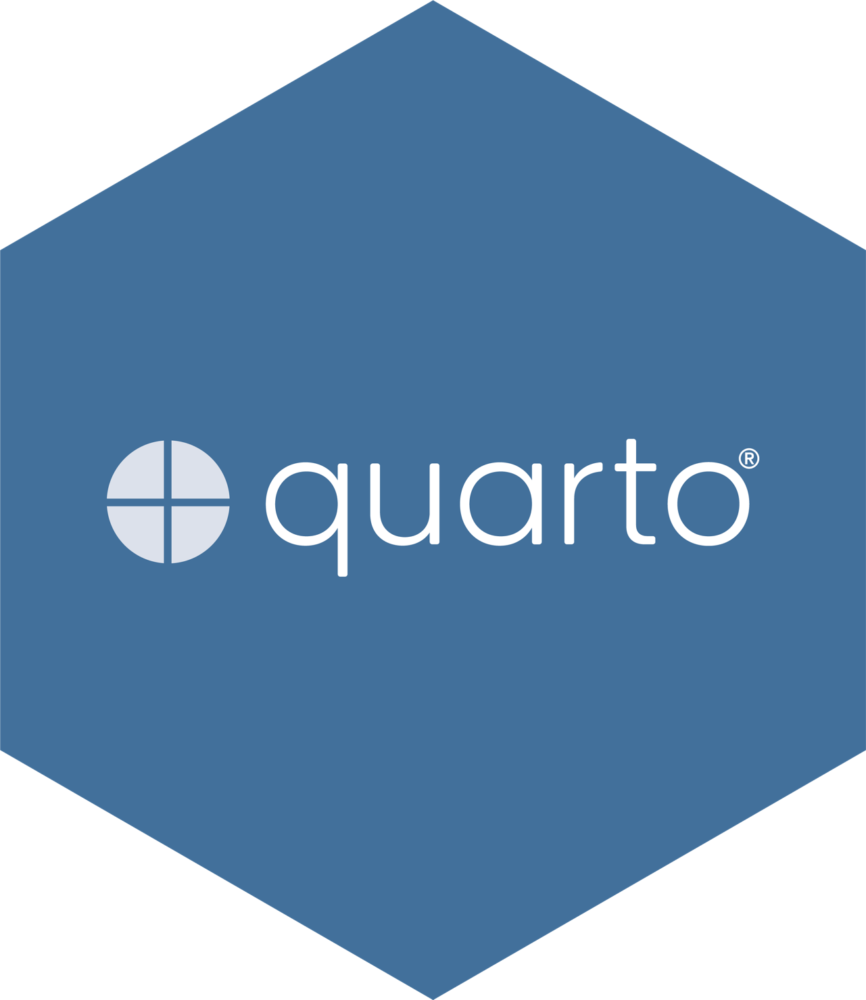{.hex}
[Scheduled Quarto batch job on Connect]{.cap}
:::

::: {.row .hexrow}
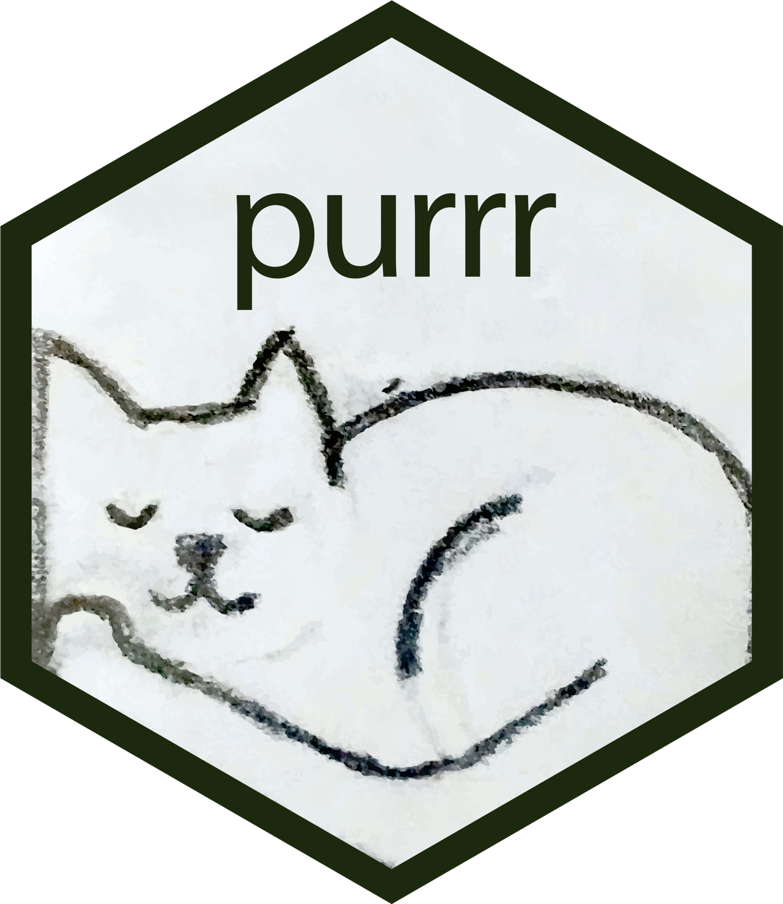{.hex}
[[purrr]{.pkg} — the API returns deeply nested lists; this is what flattens them]{.cap}
:::
::::
:::::

::: {.kicker}
Four independently deployable pieces, each with one job — the same separation of concerns that let two companies build without blocking each other.
:::

::: {.kicker}
Blythe's test: would we have designed it this way even if it weren't an AI app? Yes — which is exactly the point.
:::

::: notes
Keaton: modularizing the backend independently from the front end is what made the parallel, non-blocking collaboration possible. Four pieces, each with one job.

ORCA — Michael's side. Worth naming brand.yml here: KS&R's brand book went in as a config file, so the app picked up our colours and type without anyone hand-porting them. That's the constraints-as-a-gift slide paying off in practice.

ORCAstra — the plumber point is the one to land: we built a well-defined surface for each core function and hosted them internally, so the front end could call a stable endpoint while everything behind it kept changing. It leans on ksRAI, an internal R package we wrote to make interfacing with the OpenAI API straightforward — cost estimation, batch submission, response parsing — so that logic lives in one tested place instead of being scattered through the API.

ORCAdb — pins on Connect for versioned metadata and run history.

ORCAwatch — a scheduled Quarto document on Connect. purrr is not decoration here: the batch API returns deeply nested lists, and the shape of the coding data is nested too, so the whole wrangling step is map/pluck work.
:::

## Build a seam, not a handoff {.paper}

::: {.eyebrow}
TAKEAWAY — AFTER YOU SHIP
:::

::: {.bullets .lg .mt-lg}
- Pick the boundary between the two teams **deliberately**, then make it something both sides can build against without waiting — an API, a versioned artifact, a pinned dataset.
- A good seam means either side can be replaced, rewritten, or handed to someone new without renegotiating the whole system. That's what makes the collaboration outlast the project.
:::

::: {.next .mt-lg}
Next — Michael, closing us out →
:::

::: notes
Keaton, active takeaway for chapter 3: the architecture is what lets the collaboration survive. Choose the seam on purpose, make it stable, and both sides stay unblocked long after the initial build.
:::

## Not just ORCA — a repeatable model for cross-company collaboration on the Posit stack. {.cream .statement}

::: {.eyebrow}
THE REAL PRODUCT
:::

::: notes
Through rigorous wireframing, providing style guides up front, using issues/branches/PRs to strongly document, delegate, and isolate your work 

Michael: the real product wasn't just ORCA — it was a repeatable model for cross-company, cross-discipline collaboration on the Posit stack.
:::

## Bring a design artifact to your next cross-team project — not just code {.paper}

::: {.eyebrow}
IF YOU'RE BUILDING WITH A PARTNER TEAM
:::

:::: {.cols-3 .mt-lg}
::: {.card .cream}
A shared visual contract — Mural, Excalidraw, or a whiteboard, before anyone opens an editor.
:::
::: {.card .cream}
Issue-driven development — a shared source of truth across company lines. Don't skimp on detail in your Issues & PR bodies.
:::
::: {.card .cream}
An architecture — [golem]{.pkg} + [plumber]{.pkg} + [pins]{.pkg} — that lets both sides move independently.
:::
::::

::: notes
Michael: if you're building Shiny apps with a partner team — agency/client, research/engineering, frontend/backend — invest early in shared visual contracts, issue-driven development, and an architecture that lets both sides move independently against a stable interface.
:::

## Thank you {.navy .closing}

::::: {.people .mt-lg}
:::: person
{.headshot-lg}

[Keaton Wilson]{.name}
[(Previously) KS&R — Director, Solutions]{.role}
[On ORCA: the back-end pipelines]{.hat}
[AI Engineer — CHG Healthcare]{.role}

::: {.qr .placeholder}
LinkedIn QR
:::
::::
:::: person
{.headshot-lg}

[Michael Thomas]{.name}
[Ketchbrook Analytics — Chief Data Scientist]{.role}
[On ORCA: the interface]{.hat}

::: {.qr .placeholder}
LinkedIn QR
:::
::::
:::::

::: footer-logos
{.logo-xs}
{.logo-sm}
:::

::: notes
Both: thank the audience, invite questions. Point at the QR codes — connect with us on LinkedIn. Note that the QR codes / links on the last slide have additional resources the audience might find helpful on these topics.
:::

<!--
## Three ways cross-team builds fall apart {.cream}

::: {.eyebrow}
A FAMILIAR FAILURE MODE
:::

:::: {.cols-3 .mt-lg}
::: col
[01]{.num}
[No clear division of labor]{.sub}

One person quietly ends up carrying the whole project.
:::
::: col
[02]{.num}
[No shared tooling]{.sub}

Work happens in silos, stitched together at the last minute.
:::
::: col
[03]{.num}
[No shared goals or guardrails]{.sub}

Different vision, even if division of labor is clear, serving the part and not the whole.
:::
::::

::: notes
You might have good reason to avoid working on a team; maybe you've been burned by one of the three ways that team data science falls apart.

Yes, today's talk involves a Shiny app, but it's really a story about an effective collaboration model between a small team working in Market Research and a data and software development consultants. A model that leveraged UI/UX best practices, a careful and conscious division of labor and a Posit-enriched tech stack to facilitate.
:::
-->
