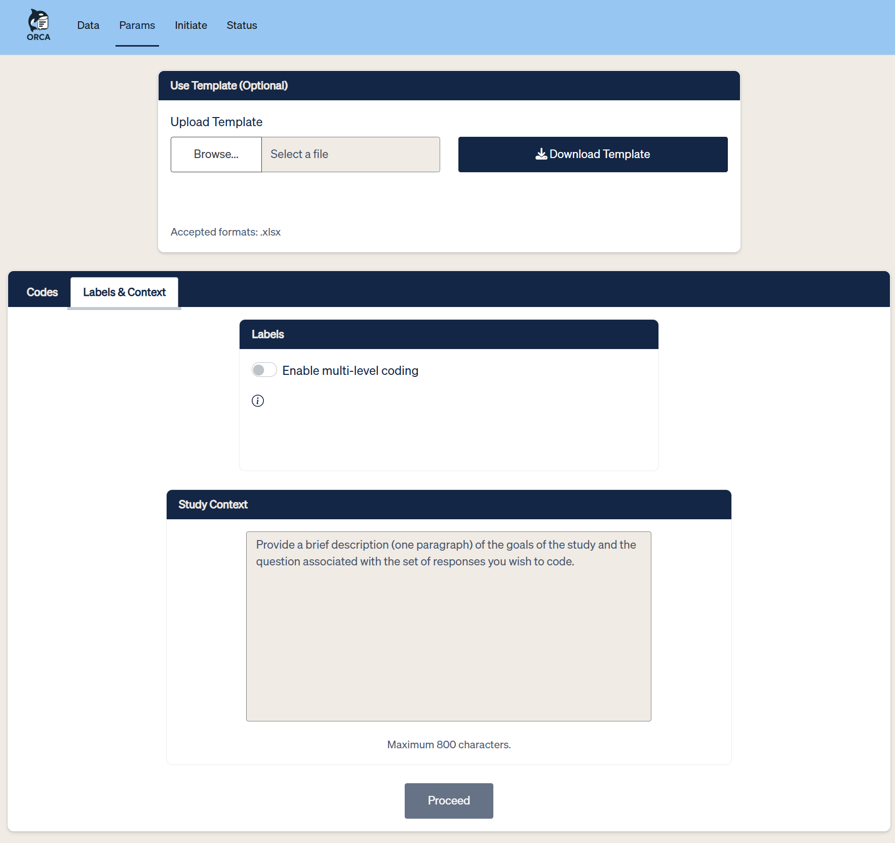

---
# RevealJS config lives in ../_quarto.yml.
pagetitle: "ORCA — a collaboration to build an AI-powered Shiny app"
author: "Keaton Wilson · Michael Thomas"
description: |
  posit::conf(2026). Ported from ORCA__AI-powered_survey_coding.pptx.
---

## {.navy .title-slide-custom}

::: {.eyebrow}
POSIT::CONF(2026)
:::

[ORCA]{.display}

[a **collaboration to build** an AI-powered Shiny app, deployed on Posit Team]{.tagline}

:::: {.byline .mt-a}
::: col
[Keaton Wilson]{.name}
[(Previously) KS&R — Director, Solutions]{.role}
:::
::: rule
:::
::: col
[Michael Thomas]{.name}
[Ketchbrook Analytics — Chief Data Scientist]{.role}
:::
::::

::: notes
Keaton: welcome, introduce the talk and both presenters.

Share the function of what we do. Share the people that we help. Share the impact of that work.

Feedback: let's do our 2 intros and really emphasize the fact that we work w/ two different companies; set up that we're going to talk about collaboration — talk about the different ways our brain works: "Michael is the X guy", "Keaton is the Y guy", etc.

Let's be sure to make it very clear in our setup (this slide & beyond) that this talk is about *collaboration* with examples from our ORCA use case, as opposed to a deep-dive into a specific app.
:::

## {.cream}

:::: {.split .split-even .v-center .fill}
::: col
{width="880"}
:::
::: col
::: {.eyebrow}
LET'S START HERE
:::

[We've all been on this team.]{.headline}
:::
::::

::: notes
Keaton, opening beat: hold for the laugh. Everyone in this room has been on this team — from group projects in school, to cross-functional committees at companies we work for, and even for business-consultant partnerships developing code and software.

How many folks in the room typically work as a lone wolf solo data scientist at their day job?

Feedback: Can we show another meme/gif either at the end (or pretty much right after this) with the Elaine dancing gif when we reveal that the collaboration actually worked great?
:::

## Three ways cross-team builds fall apart {.cream}

::: {.eyebrow}
A FAMILIAR FAILURE MODE
:::

:::: {.cols-3 .mt-lg}
::: col
[01]{.num}
[No clear division of labor]{.sub}

One person quietly ends up carrying the whole project.
:::
::: col
[02]{.num}
[No shared tooling]{.sub}

Work happens in silos, stitched together at the last minute.
:::
::: col
[03]{.num}
[No shared goals or guardrails]{.sub}

Different vision, even if division of labor is clear, serving the part and not the whole.
:::
::::

::: notes
You might have good reason to avoid working on a team; maybe you've been burned by one of the three ways that team data science falls apart.

Yes, today's talk involves a Shiny app, but it's really a story about an effective collaboration model between a small team working in Market Research and a data and software development consultants. A model that leveraged UI/UX best practices, a careful and conscious division of labor and a Posit-enriched tech stack to facilitate.
:::

## This wasn't that. {.navy .statement}

[A front-end team and a back-end team, at **two different companies**, who had to depend on each other to ship anything at all — and built the collaboration that made that dependency work.]{.lede}

::: notes
Keaton: pivot hard. This still happens in industry — a stakeholder handing over a one-paragraph spec with no back-and-forth. ORCA is the opposite story: two companies who had to depend on each other, and made that dependency work.

Feedback: We're giving too much info here — we're diving into the talk too quickly here; let's do a little less of the collaboration setup.

Start the story w/ the bookends: it started w/ a problem, ended with a solution, and *then* we'll fill in the middle after that.
:::

## Coding open-end survey responses is slow, manual, and inconsistent at scale {.paper}

::: {.eyebrow}
WHY ORCA EXISTS
:::

[AI can accelerate the work of categorizing thousands of free-text answers. But for a research firm's internal stakeholders and clients, speed means nothing without trust in the result.]{.lede .mt-md}

::: {.chips .mt-lg}
[Transparency]{.chip}
[Trust]{.chip}
[Reproducibility]{.chip}
:::

::: notes
Keaton: open-end survey coding is slow, manual, and inconsistent at scale. AI can accelerate it — but internal stakeholders and clients won't accept a black box.
:::

## ORCA is now how KS&R's researchers code **thousands** of open-end responses {.paper .headline-right}

::: {.eyebrow}
What is ORCA?
:::

:::: {.cols-4 .fill .mt-md}
::: col
[]{.frame style="height:433px;"}

[1]{.step} [Upload data]{.label}
:::
::: col
[]{.frame style="height:433px;"}

[2]{.step} [Define codes]{.label}
:::
::: col
[]{.frame style="height:433px;"}

[3]{.step} [Review & initiate]{.label}
:::
::: col
[]{.frame style="height:433px;"}

[4]{.step} [Track & pick up]{.label}
:::
::::

::: notes
Keaton: the proof is in the pudding. ORCA is now how KS&R's researchers code thousands of open-ended survey responses with AI — in production, in daily use.
:::

## One system, two companies {.cream}

::: {.eyebrow}
A CROSS-COMPANY BUILD
:::

[Built as one of KS&R's DS&I project teams — a research firm and an external consultancy, one shared build.]{.cap .mt-sm}

::::: {.versus .fill .mt-md}
:::: {.card .centered}
{.logo-xl}

::: foot
[Research firm — backend & infrastructure owner]{.cap}
:::
::::
::: glyph
\+
:::
:::: {.card .centered}
{.logo-lg}

{.logo-md}

::: foot
[Consultancy — front-end & UX owner]{.cap}
:::
::::
:::::

::: notes
The work to build this solution was very explicitly divided: KS&R owned the back-end, server-side code, and the front-end user interface was Ketchbrook's responsibility.

Maybe this sounds scary, but there are some obvious benefits to this:

- Speed: if you can truly work in parallel, obviously two people working simultaneously will get the job done faster than one
- Error catching: more eyes on the code is more likely to catch issues
- Diversity of thought: the best ideas will prevail (as opposed to only one person's idea)
- Specialization: no one individual person has to be a jack-of-all-trades — people can focus on what they're best at

Keaton: ORCA is a collaboration talk, not just a tech talk. KS&R (research firm, backend/infra owner) and Ketchbrook Analytics (consultancy, front-end/UX owner) designed and built this together, across a company boundary, as part of KS&R's DS&I project-teams model.

Feedback: Have Keaton talk about *why* KS&R sought out an external collaborator as opposed to just doing it themselves in-house.
:::

## Front-end external, back-end in-house {.paper}

::: {.eyebrow}
A DELIBERATE CONSTRAINT
:::

:::: {.cols-2 .mt-lg}
::: col
[Keeping AI spend, API keys, and job orchestration in-house lowered institutional and financial risk — an external partner touching the backend carries more exposure than one shaping the UI.]{.lede}
:::
::: col
[It also meant Ketchbrook could move fast on the front end without waiting on KS&R's internal security review for every change.]{.lede}
:::
::::

::: notes
Keaton: why front-end external, back-end in-house? Lower institutional and financial risk for an external partner to touch the AI-spend backend versus the UI. This is a limitation worth naming early, not saving for the end.
:::

## {.navy}

::: {.eyebrow}
TWO LENSES ON ONE BUILD
:::

:::: {.split .split-even .ruled .fill .mt-md}
::: col
[Michael]{.who}

[The Shiny front end]{.sub}

Job submission, response review, interactive category editing, all with [{golem}]{.pkg} for long term maintainability and modularity.
:::
::: col
[Keaton]{.who}

[The Posit-based back end]{.sub}

[{plumber}]{.pkg} middleware, [{pins}]{.pkg}, and scheduled Quarto workflows.
:::
::::

::: hrule
:::

::: {.kicker}
The throughline: at every stage, a front-end decision made the back-end's job **harder or easier** — and vice versa.
:::

::: {.next}
Next — Michael, on designing together before writing code →
:::

::: notes
Keaton: two lenses on what follows — Michael on the Shiny front end (job submission, response review, interactive code editing), me on the Posit-based back end (golem, plumber, pins, scheduled workflows). Over to Michael.
:::

## Designing together, before writing a line of code {.navy .chapter}

::: {.eyebrow}
CHAPTER 1
:::

::: {.speaker}
Michael
:::

::: hrule
:::

::: chips
[Mural]{.chip}
[KS&R brand book]{.chip}
[Design system & font files]{.chip}
:::

::: notes
Michael takes over.
:::

## Wireframing together before a single line of code {.cream}

::: {.eyebrow}
SHARED UNDERSTANDING, FIRST
:::

::: bleed
{.pin style="left:100px;  top:248px; width:816px;"}
{.pin style="left:678px;  top:517px; width:816px;"}
{.pin style="left:1196px; top:634px; width:686px;"}

[Stakeholder engagement, wireframes and API shape, sketched together in Mural — before either side committed to an implementation.]{.pin .lede style="left:1209px; top:300px; width:615px;"}
:::

::: notes
Feedback: For each phase of the project (before, during, after), we need to have an *active takeaway* for the audience that reinforces the **collaboration**.

Michael: shared understanding first. Wireframing sessions in Mural, where UI mockups and API/data shape were sketched in the same room before either side committed to an implementation.
:::

## The brand book as a forcing function {.paper}

::: {.eyebrow}
CONSTRAINTS AS A GIFT
:::

[Early visual constraints gave the front end a fixed target — which in turn gave the back end a stable target: what data the UI would need, in what shape, on what cadence.]{.lede style="margin-top:320px; max-width:860px;"}

::: bleed
{.pin style="left:1313px; top:0px;    width:607px;"}
{.pin style="left:1313px; top:252px;  width:607px;"}
{.pin style="left:1313px; top:848px;  width:304px;"}
{.pin style="left:1616px; top:846px;  width:304px;"}
:::

::: notes
Michael: KS&R's brand book and design system as a forcing function — it gave the front end constraints early, which gave the back end a stable target: what data the UI would need, in what shape, on what cadence.
:::

## One workflow, two contracts {.cream}

::: {.eyebrow}
THE KEY MOVE
:::

:::: {.split .split-even .fill .mt-md}
::: col
[]{.frame .crop style="height:697px;"}
:::
::: {.col .middle-stack}
[Submit a coding job]{.bar}
[Review AI suggestions]{.bar}
[Edit & approve]{.bar}

[↓]{.glyph}

::: {.row .tight}
[UI spec]{.tag}
[API contract]{.tag}
:::
:::
::::

::: notes
Michael: the key move — translating a research workflow (submit a job, review AI suggestions, edit/approve) into a UI spec and an API contract at the same time, so neither side was guessing about the other's needs.
:::

## A contract, agreed on visually, before a single [{plumber}]{.pkg} endpoint existed. {.navy .statement}

::: notes
Michael: this is the front end making the back end's life easier — a clear contract, agreed on visually, before a single plumber endpoint existed.
:::

## Building in parallel, without blocking each other {.navy .chapter}

::: {.eyebrow}
CHAPTER 2
:::

::: {.speaker}
Michael
:::

::: hrule
:::

::: chips
[GitHub Issues & PRs]{.chip}
[{golem}]{.chip}
[{plumber}]{.chip}
:::

::: notes
Michael continues into chapter 2.
:::

## Issues and PRs as the shared source of truth {.paper}

::: {.eyebrow}
WORKING ASYNC, ACROSS COMPANIES
:::

:::: {.cols-2 .mt-lg}
::: col
[GitHub Issues tracked what needed to happen and who owned it — across two companies, with no shared Slack or shared employer.]{.lede}
:::
::: col
[A branching model let each side ship independently against the agreed contract, and merge without stepping on the other's work.]{.lede}
:::
::::

::: notes
Michael: how the teams worked async across two companies — GitHub Issues and PRs as shared source of truth, a branching model that let front-end and back-end ship independently against the agreed contract.
:::

## A stable seam between two codebases {.cream}

::: {.eyebrow}
THE ARCHITECTURE THAT MADE IT POSSIBLE
:::

:::: {.chain .fill .mt-md}
::: {.card .centered}
[ORCA]{.sub}
[{golem} Shiny app]{.cap}
[Ketchbrook]{.tenant}
:::
::: glyph
↔
:::
::: {.card .navy .centered}
[ORCAstra]{.sub}
[{plumber} API]{.cap}
[KS&R]{.tenant}
:::
::: glyph
↔
:::
::: {.card .centered}
[OpenAI]{.sub}
[classification engine]{.cap}
:::
::::

::: {.kicker}
The UI iterated against a stable API surface while the heavier logic behind it kept changing.
:::

::: notes
Michael: the architecture that made this possible — a golem-based Shiny app decoupled from a plumber API for asynchronous job processing, so the UI could be built and iterated against a stable API surface while the heavier AI/coding logic evolved behind it.
:::

## UX needs and backend constraints, both ways {.paper}

::: {.eyebrow}
IT WENT BOTH DIRECTIONS
:::

:::: {.split .split-even .fill .mt-md}
::: {.col .middle-stack}
::: {.row .exchange}
[Live job status & inline editing of AI output]{.bar .cream}
[→]{.glyph}
[Async job handling, structured logging]{.bar .solid}
:::

::: {.row .exchange .mt-sm}
[Batch cost & timing]{.bar .solid}
[→]{.glyph}
[Progress states, review queues]{.bar .cream}
:::
:::
::: col
[]{.frame .crop style="height:639px;"}

[The status table users asked for — and the structured logging behind it.]{.cap .mt-sm}
:::
::::

::: notes
Michael: a UX need — live job status, inline editing of AI output — drove a backend design decision (async job handling, structured logging). A backend constraint — batch cost and timing — shaped a front-end pattern (progress states, review queues).
:::

## Not an assertion — **receipts.** {.navy .statement}

[Issues, PRs, and a contract everyone could point to — that's why this collaboration held together.]{.lede}

::: {.next .mt-lg}
Next — Keaton, on earning trust in production →
:::

::: notes
Michael: this answers Keaton's opening question directly — why did this collaboration succeed — with receipts, not just an assertion. Over to Keaton for chapter 3.
:::

## Separation of concerns, in production {.navy .chapter}

::: {.eyebrow}
CHAPTER 3
:::

::: {.speaker}
Keaton
:::

::: hrule
:::

::: chips
[{pins}]{.chip}
[Posit Connect]{.chip}
[Scheduled Quarto]{.chip}
:::

::: notes
Keaton takes back over for chapter 3.
:::

## A modular backend, decoupled by design {.cream}

::: {.eyebrow}
WHAT MADE PARALLEL WORK POSSIBLE
:::

::::: {.cols-4 .fill .mt-md}
:::: card
[ORCA]{.sub}

::: {.row .hexrow}
{.hex}
[Shiny front end]{.cap}
:::

::: {.row .hexrow}
{.hex}
[[{golem}]{.pkg} for modularity and maintainability]{.cap}
:::

::: {.row .hexrow}
{.hex}
[[{bslib}]{.pkg}]{.cap}
:::
::::
:::: card
[ORCAstra]{.sub}

::: foot
[{plumber} async API]{.cap}
:::
::::
:::: card
[ORCAdb]{.sub}

::: foot
[{pins} versioned metadata]{.cap}
:::
::::
:::: card
[ORCAwatch]{.sub}

::: foot
[Scheduled Quarto batch job]{.cap}
:::
::::
:::::

::: {.kicker}
Four independently deployable pieces, each with one job — the same separation of concerns that let two companies build without blocking each other.
:::

::: {.kicker}
Blythe's test: would we have designed it this way even if it weren't an AI app? Yes — which is exactly the point.
:::

::: notes
Keaton: modularizing the backend independently from the front end is what made the parallel, non-blocking collaboration possible. ORCAstra for async processing, ORCAdb/pins for versioned metadata, ORCAwatch for scheduled batch logging and delivery.
:::

## I really wanted to dig into AI best practices here. {.paper .statement}

::: {.eyebrow}
A QUICK ASIDE
:::

[Prompt design, cost control, model versioning — genuinely interesting, and relevant to my new role. But this talk was never really about the AI. It was about the collaboration. Here's where to find it if you're curious.]{.lede}

::: notes
Keaton: I wanted to dig into AI-specific best practices here — prompt design, cost control, model versioning. But this talk isn't really about the AI, it's about the collaboration. Here's what I want you to know if you're curious — it's all in a repo, QR code TBD.
:::

## Trust is a **joint** deliverable. {.navy}

:::: {.split .split-wide .fill .mt-lg}
::: col
[Versioned metadata and an audit trail keep every AI-coded result traceable to a model and a data snapshot. Human judgment stays in the loop at the front end — and it only works because the back end guarantees what's underneath is reproducible.]{.lede}
:::
::: col
[]{.frame .crop style="height:362px;"}

[Study context and coding labels — where the researcher's judgment enters the pipeline.]{.cap .mt-sm}
:::
::::

::: {.next}
Next — Michael, closing us out →
:::

::: notes
Keaton: pins for versioned metadata mean every AI-coded result is traceable to a model version and data snapshot. Scheduled batch workflows leave an audit trail. Ties back to the front end: the categorization spec and context interface is where human judgment stays in the loop — and it only works because the backend guarantees what's underneath is versioned and reproducible.
:::

## Not just ORCA — a repeatable model for cross-company collaboration on the Posit stack. {.cream .statement}

::: {.eyebrow}
THE REAL PRODUCT
:::

::: notes
Michael: the real product wasn't just ORCA — it was a repeatable model for cross-company, cross-discipline collaboration on the Posit stack.
:::

## Bring a design artifact to your next cross-team project — not just code {.paper}

::: {.eyebrow}
IF YOU'RE BUILDING WITH A PARTNER TEAM
:::

:::: {.cols-3 .mt-lg}
::: {.card .cream}
A shared visual contract — Mural, Excalidraw, or a whiteboard, before anyone opens an editor.
:::
::: {.card .cream}
Issue-driven development — a shared source of truth across company lines. Don't skimp on detail in your Issues & PR bodies.
:::
::: {.card .cream}
An architecture — [{golem}]{.pkg} + [{plumber}]{.pkg} + [{pins}]{.pkg} — that lets both sides move independently.
:::
::::

::: notes
Michael: if you're building Shiny apps with a partner team — agency/client, research/engineering, frontend/backend — invest early in shared visual contracts, issue-driven development, and an architecture that lets both sides move independently against a stable interface.
:::

## Thank you {.navy .closing}

::: footer-logos
{.logo-xs}
{.logo-sm}
:::

::: notes
Both: thank the audience, invite questions.
:::
